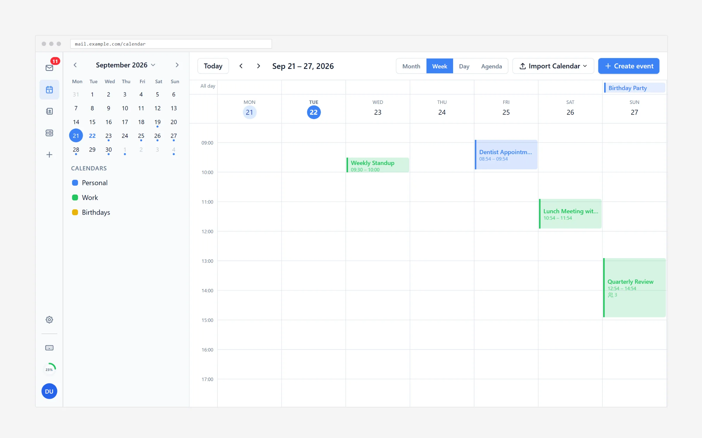
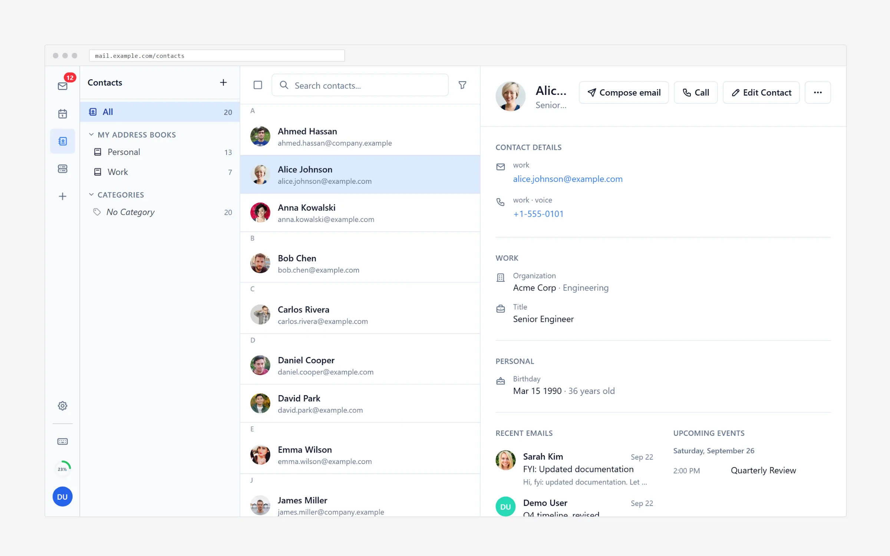
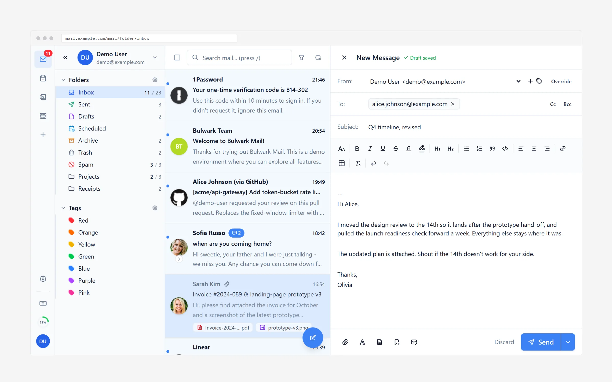
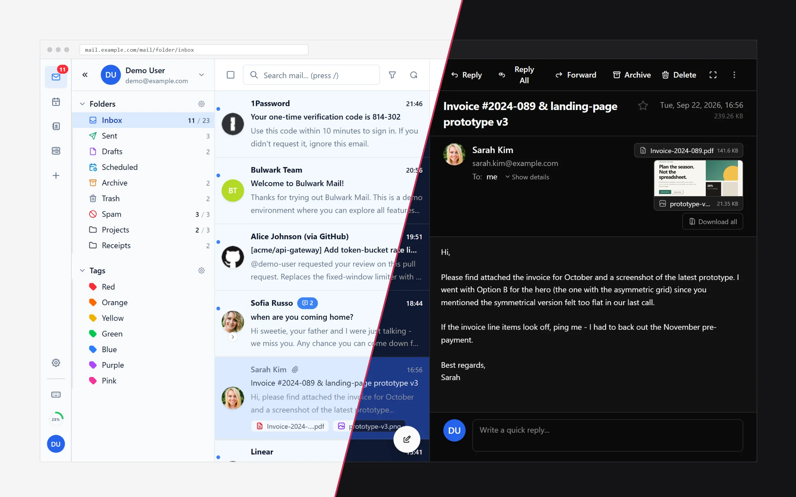

<p>
  <a href="https://bulwarkmail.org"></a>
</p>

<p align="center">
  <a href="https://github.com/bulwarkmail/webmail/releases/latest"><picture><source media="(prefers-color-scheme: dark)" srcset="https://raw.githubusercontent.com/bulwarkmail/.github/main/badges/release-dark.svg" /></picture></a>&nbsp;
  <a href="https://github.com/bulwarkmail/webmail/pkgs/container/webmail"><picture><source media="(prefers-color-scheme: dark)" srcset="https://raw.githubusercontent.com/bulwarkmail/.github/main/badges/docker-dark.svg" /></picture></a>&nbsp;
  <a href="LICENSE"><picture><source media="(prefers-color-scheme: dark)" srcset="https://raw.githubusercontent.com/bulwarkmail/.github/main/badges/license-dark.svg" /></picture></a>&nbsp;
  <a href="https://discord.gg/tYCujymGrT"><picture><source media="(prefers-color-scheme: dark)" srcset="https://raw.githubusercontent.com/bulwarkmail/.github/main/badges/discord-dark.svg" /></picture></a>
</p>

<p align="center">
  <a href="https://bulwarkmail.org">Website</a> ·
  <a href="https://bulwarkmail.org/docs">Documentation</a> ·
  <a href="https://demo.bulwarkmail.org">Live demo</a> ·
  <a href="https://github.com/bulwarkmail/webmail/releases">Releases</a> ·
  <a href="https://discord.gg/tYCujymGrT">Discord</a>
</p>

Bulwark Webmail is a self-hosted webmail client for [Stalwart Mail Server](https://stalw.art/). It talks to Stalwart over JMAP and puts mail, calendar, contacts and files behind one login, with one set of settings and one admin dashboard.

<p align="center">
  <a href="https://bulwarkmail.org/docs/features/overview"><picture><source media="(prefers-color-scheme: dark)" srcset="screenshots/dark-laptop-phone.webp" /></picture></a>
</p>

## Contents

- [Screenshots](#screenshots)
- [Features](#features)
- [Quick start](#quick-start)
- [Other ways to install](#other-ways-to-install)
- [Configuration](#configuration)
- [Documentation](#documentation)
- [Development](#development)
- [Use of AI](#use-of-ai)
- [Community and support](#community-and-support)
- [License](#license)

## Screenshots

<p align="center">
  <a href="https://bulwarkmail.org/docs/features/calendar"><picture><source media="(prefers-color-scheme: dark)" srcset="screenshots/dark-calendar-week.webp" /></picture></a>
  <a href="https://bulwarkmail.org/docs/features/contacts"><picture><source media="(prefers-color-scheme: dark)" srcset="screenshots/dark-contact.webp" /></picture></a>
  <br />
  <sub>Calendar week view&nbsp;&nbsp;·&nbsp;&nbsp;Contact details with recent mail and upcoming events</sub>
</p>

<p align="center">
  <a href="https://bulwarkmail.org/docs/features/email/composing"><picture><source media="(prefers-color-scheme: dark)" srcset="screenshots/dark-composer.webp" /></picture></a>
  <a href="https://bulwarkmail.org/docs/guides/customization"></a>
  <br />
  <sub>Composer with identities and formatting&nbsp;&nbsp;·&nbsp;&nbsp;Light and dark themes</sub>
</p>

## Features

- [Mail](https://bulwarkmail.org/docs/features/email): threading, unified inbox, cross-account views, [full-text search](https://bulwarkmail.org/docs/features/email/search), Sieve filters, [S/MIME](https://bulwarkmail.org/docs/guides/smime), templates, scheduled send
- [Calendar](https://bulwarkmail.org/docs/features/calendar): month, week, day and agenda views, recurring events, iMIP invitations, CalDAV subscriptions
- [Contacts](https://bulwarkmail.org/docs/features/contacts): several address books, groups, vCard import and export
- [Files](https://bulwarkmail.org/docs/features/files): Stalwart's JMAP file storage, with previews, sharing and folder upload

All four share [single sign-on](https://bulwarkmail.org/docs/getting-started/configuration/authentication) and [2FA](https://bulwarkmail.org/docs/guides/account-security), [multiple accounts](https://bulwarkmail.org/docs/guides/multi-account), 27 languages, [PWA install and web push](https://bulwarkmail.org/docs/features/pwa), [themes](https://bulwarkmail.org/docs/guides/customization), [plugins](https://bulwarkmail.org/docs/guides/plugins) and [keyboard shortcuts](https://bulwarkmail.org/docs/guides/keyboard-shortcuts). The full list is on the [All features](https://bulwarkmail.org/docs/features/overview) page.

There are two [editions](https://bulwarkmail.org/docs/getting-started/editions). The full edition runs as a Node.js server and adds the admin dashboard, OAuth, plugins and settings sync. [Bulwark Lite](https://bulwarkmail.org/docs/getting-started/lite) is the same client as static files, served by any web host or by Stalwart itself.

## Quick start

```bash
docker run -d -p 3000:3000 ghcr.io/scjtqs2/webmail:latest
```

Then open `http://localhost:3000`. A setup wizard asks for your Stalwart server and an admin password. The [installation guide](https://bulwarkmail.org/docs/getting-started/installation) has the details, and [Stalwart setup](https://bulwarkmail.org/docs/getting-started/configuration/stalwart-setup) covers the mail server side.

## Other ways to install

| Method | Guide |
| --- | --- |
| Docker Compose | [Compose](https://bulwarkmail.org/docs/deployment/docker/compose) |
| Behind a reverse proxy or on a sub-path | [Reverse proxy](https://bulwarkmail.org/docs/deployment/docker/reverse-proxy) |
| From source, without Docker | [Manual install](https://bulwarkmail.org/docs/deployment/manual) |
| Lite on any static host | [Static hosting](https://bulwarkmail.org/docs/deployment/static) |
| Lite as a container | [Container image](https://bulwarkmail.org/docs/deployment/static#container-image) |
| Lite served by Stalwart | [Install on Stalwart](https://bulwarkmail.org/docs/deployment/stalwart-app) |

[Updating](https://bulwarkmail.org/docs/deployment/updating) explains how to move to a new version.

Container images and release files from 1.12.0 on come with a signed build provenance attestation. To check that one was built by this repository's workflows, run `gh attestation verify oci://ghcr.io/bulwarkmail/webmail:<version> --owner bulwarkmail` for an image, or `gh attestation verify <file> --repo bulwarkmail/webmail` for a downloaded file. Release files also have a `.sha256` next to them.

## Configuration

Most installs are set up in the wizard on first launch and changed later in the [admin dashboard](https://bulwarkmail.org/docs/guides/admin). You can also use environment variables, which fit read-only or immutable deployments better. When both set the same key, the value saved in the admin config wins, so an environment variable only fills in what the admin config leaves unset.

```env
JMAP_SERVER_URL=https://mail.example.com
APP_NAME=My Webmail
```

| Topic | Guide |
| --- | --- |
| Overview, config files and precedence | [Configuration](https://bulwarkmail.org/docs/getting-started/configuration) |
| Every variable | [Environment reference](https://bulwarkmail.org/docs/getting-started/configuration/environment-reference) |
| OAuth2 / OIDC and single sign-on | [Authentication](https://bulwarkmail.org/docs/getting-started/configuration/authentication), [Embedded SSO](https://bulwarkmail.org/docs/guides/embedded-sso) |
| Several JMAP servers, custom endpoints | [Multi-server deployments](https://bulwarkmail.org/docs/getting-started/configuration/stalwart-setup#multi-server-deployments), [Custom endpoints](https://bulwarkmail.org/docs/getting-started/configuration#custom-jmap-server-endpoints) |
| Branding, logos, per-domain branding | [Customization](https://bulwarkmail.org/docs/guides/customization) |
| Anonymous telemetry (off by default) | [Anonymous usage stats](https://bulwarkmail.org/docs/features/telemetry) |

## Documentation

All documentation is at [bulwarkmail.org/docs](https://bulwarkmail.org/docs):

- Getting started: [Introduction](https://bulwarkmail.org/docs/getting-started/introduction), [Installation](https://bulwarkmail.org/docs/getting-started/installation), [Editions](https://bulwarkmail.org/docs/getting-started/editions), [Bulwark Lite](https://bulwarkmail.org/docs/getting-started/lite), [Demo mode](https://bulwarkmail.org/docs/getting-started/demo-mode)
- Deployment: [Docker](https://bulwarkmail.org/docs/deployment/docker), [Manual install](https://bulwarkmail.org/docs/deployment/manual), [Static hosting](https://bulwarkmail.org/docs/deployment/static), [Install on Stalwart](https://bulwarkmail.org/docs/deployment/stalwart-app), [Updating](https://bulwarkmail.org/docs/deployment/updating)
- Guides: [Admin dashboard](https://bulwarkmail.org/docs/guides/admin), [Account security](https://bulwarkmail.org/docs/guides/account-security), [Impersonation](https://bulwarkmail.org/docs/guides/impersonation), [Plugins](https://bulwarkmail.org/docs/guides/plugins), [Marketplace](https://bulwarkmail.org/docs/guides/marketplace), [Troubleshooting](https://bulwarkmail.org/docs/guides/troubleshooting)
- Extensions: [Introduction](https://bulwarkmail.org/docs/extensions/introduction), [manifest.json](https://bulwarkmail.org/docs/extensions/manifest), [Publishing](https://bulwarkmail.org/docs/extensions/publishing)
- Development: [Architecture](https://bulwarkmail.org/docs/development/architecture), [Contributing](https://bulwarkmail.org/docs/development/contributing)
- Legal: [Privacy](https://bulwarkmail.org/docs/legal/privacy)

The pages are Markdown files in the [website repository](https://github.com/bulwarkmail/website/tree/main/docs). Send corrections there.

## Development

```bash
git clone https://github.com/bulwarkmail/webmail.git
cd webmail
npm install
cp .env.dev.example .env.local   # built-in mock JMAP server, no mail server needed
npm run dev
```

```bash
npm run typecheck
npm run lint
npx vitest run             # unit tests
npm run test:integration   # Stalwart in Docker + Playwright
```

The [contributing guide](https://bulwarkmail.org/docs/development/contributing) covers tests, translations, code style and pull requests. [Architecture](https://bulwarkmail.org/docs/development/architecture) explains how the code is organized.

The stack: [Next.js 16](https://nextjs.org/) and React 19, TypeScript, [Tailwind CSS v4](https://tailwindcss.com/), [Zustand](https://zustand-demo.pmnd.rs/), [Tiptap](https://tiptap.dev/), [next-intl](https://next-intl-docs.vercel.app/), [Tabler Icons](https://tabler.io/icons), and our own JMAP client (RFC 8620). Tests run on [Vitest](https://vitest.dev/) and [Playwright](https://playwright.dev/).

## Use of AI

AI tools are part of how Bulwark is developed. A change is held to the same standard whether a person or a tool wrote it: it has to be understood, reviewed and pass the checks and tests before it is merged.

Bulwark itself has no AI features and doesn't send your mail, contacts, calendar or files to an AI service. If your Stalwart server classifies spam with an LLM, Bulwark shows the verdict, but the classification happens on your server.

Contributors can use AI tools too, as long as they use capable, current models and not small or outdated ones. The [contributing guide](https://bulwarkmail.org/docs/development/contributing#ai-assisted-contributions) explains what we expect.

## Community and support

- Questions: check [Troubleshooting](https://bulwarkmail.org/docs/guides/troubleshooting), then ask on [Discord](https://discord.gg/tYCujymGrT).
- Bugs and feature requests: open a [GitHub issue](https://github.com/bulwarkmail/webmail/issues).
- Security vulnerabilities: report them privately to [dev@bulwarkmail.org](mailto:dev@bulwarkmail.org) or through a [security advisory](https://github.com/bulwarkmail/webmail/security/advisories/new), never in a public issue.
- Release notes: [CHANGELOG.md](CHANGELOG.md) and the [GitHub releases](https://github.com/bulwarkmail/webmail/releases).

## License

[GNU AGPL v3 only](LICENSE), with an additional permission to distribute apps built from this code through app stores such as the Apple App Store and Google Play. The permission is provisional until every earlier contributor has agreed to it ([consent request](https://github.com/orgs/bulwarkmail/discussions/1113)); contributions made since 30 September 2026 are already covered. This repository preserves the original MIT attribution for the fork lineage in [NOTICE](NOTICE).

## Acknowledgments

Thanks to [root-fr/jmap-webmail](https://github.com/root-fr/jmap-webmail/) and [@ma2t](https://github.com/ma2t) for the groundwork this project builds upon.
